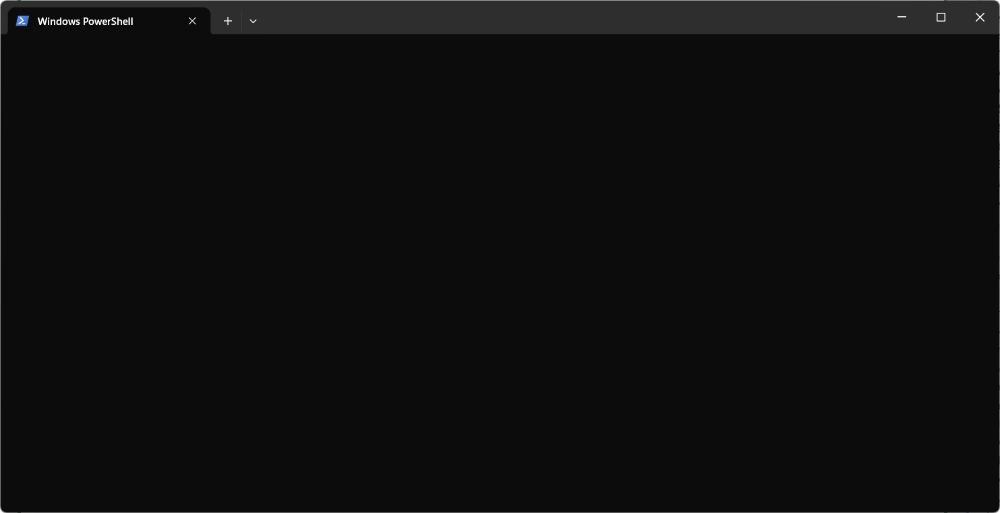

##### ai编程工具客户端

## Claude Code

**简介：** Anthropic 官方推出的命令行 AI 编程工具，代理式（agentic）编程助手，能自主规划步骤、执行任务，支持 200K+ token 上下文窗口。

### 安装

**方式 1：原生安装器（推荐，无需 Node.js）**
```powershell
# Windows PowerShell
irm https://claude.ai/install.ps1 | iex
```

**方式 2：npm 全局安装**
```powershell
npm install -g @anthropic-ai/claude-code
claude --version
```

**前置条件：** Node.js 18+（推荐 LTS 20+）

### 认证

```powershell
# 交互式登录（浏览器认证）
claude login

# 使用 API Key
$env:ANTHROPIC_API_KEY="sk-ant-xxx"
```

### 常用命令

```powershell
claude                          # 启动交互模式
claude "解释这个项目"            # 单次提问
claude --model opus-4.5         # 指定模型
claude --model sonnet-4.5       # 指定模型
claude --version                # 查看版本
claude config set model "claude-sonnet-4-20250514"  # 设置默认模型
claude update                   # 更新到最新版本
```

### 交互模式快捷操作

| 操作 | 说明 |
|------|------|
| 直接输入自然语言 | 描述需求，Claude 自主执行 |
| `/help` | 查看帮助 |
| `/compact` | 压缩上下文，释放 token |
| `/clear` | 清除当前对话 |
| `/cost` | 查看当前会话费用 |
| `Ctrl+C` | 中断当前操作 |
| `Ctrl+D` | 退出交互模式 |

### 核心特性

- **代码库理解：** 自动索引项目，理解架构和依赖关系
- **文件操作：** 读取、创建、编辑文件，自动保存
- **Git 集成：** 提交、分支管理、解决冲突
- **终端命令：** 执行 shell 命令并获取输出
- **MCP 支持：** 连接外部工具和服务

---

## Gemini CLI

**简介：** Google 推出的开源 AI 终端代理，基于 Gemini 2.5 Pro 模型，支持 1M+ token 上下文窗口，可完成代码生成、调试、自动化运维等全流程任务。

### 安装

**npm 安装（推荐）**
```powershell
npm install -g @google/gemini-cli
gemini --version
```

**yarn 安装**
```powershell
yarn global add @google/gemini-cli
```

**临时使用（不全局安装）**
```powershell
npx @google/gemini-cli
```

### 认证

```powershell
# 首次启动自动引导认证（Google 账号登录）
gemini

# 或手动设置 API Key
gemini config set api-key YOUR_API_KEY
```

### 常用命令

```powershell
gemini                          # 启动交互模式
gemini "生成一个 React 组件"     # 单次提问
gemini --version                # 查看版本
gemini --help                   # 查看帮助
gemini models                   # 列出可用模型
gemini providers                # 管理提供商和凭证
```

### 核心特性

- **1M+ token 上下文：** 处理超大型代码库
- **代码生成与审查：** 生成样板代码、审查和改进现有代码
- **调试辅助：** AI 辅助定位和修复复杂问题
- **代码迁移：** 自动化代码库迁移和重构
- **MCP 服务器：** 支持本地和远程 MCP 服务器连接
- **多模态：** 支持图像输入（截图、线框图等）

---

## OpenAI Codex CLI

**简介：** OpenAI 推出的开源命令行编程代理，基于 o3/o4-mini 模型，轻量级终端工具，支持自主编码、图像附件、进度追踪等功能。

### 安装

**npm 安装**
```powershell
npm install -g @openai/codex
codex --version
```

**Homebrew 安装（macOS/Linux）**
```bash
brew install codex
```

**npx 临时使用**
```powershell
npx @openai/codex "写一个 Hello World"
```

**前置条件：** Node.js ≥ 18.0

### 认证

```powershell
# 设置 API Key
$env:OPENAI_API_KEY="sk-xxx"

# 使用自定义 Base URL（国内中转）
$env:OPENAI_BASE_URL="https://your-proxy-url.com/v1"
```

### 常用命令

```powershell
codex                           # 启动交互模式
codex "帮我重构这个函数"         # 单次提问
codex --version                 # 查看版本
codex --help                    # 查看帮助
codex exec "任务描述"            # 非交互式执行（适合 CI/CD）
```

### 交互模式快捷操作

| 操作 | 说明 |
|------|------|
| 直接输入自然语言 | 描述需求，Codex 自主执行 |
| `/help` | 查看帮助 |
| `/compact` | 压缩上下文 |
| `/model` | 切换模型 |
| `Ctrl+C` | 中断当前操作 |

### 核心特性

- **自主编码：** 根据自然语言指令自主规划和执行编码任务
- **图像附件：** 支持截图、线框图、架构图等图像输入
- **进度追踪：** 复杂任务自动追踪进度
- **沙箱执行：** 安全的代码执行环境
- **MCP 支持：** 连接外部工具和服务
- **GitHub Action：** 集成到 CI/CD 流程

### 三个工具对比

| 特性 | Claude Code | Gemini CLI | Codex CLI |
|------|-------------|------------|-----------|
| 开发商 | Anthropic | Google | OpenAI |
| 默认模型 | Sonnet/Opus | Gemini 2.5 Pro | o3/o4-mini |
| 上下文窗口 | 200K+ | 1M+ | 128K |
| 开源 | 否 | 是 | 是 |
| 安装方式 | npm/原生 | npm | npm/brew |
| 图像支持 | 是 | 是 | 是 |
| MCP 支持 | 是 | 是 | 是 |
| 免费额度 | 有（Pro 订阅） | 有（Google AI） | 有（API 付费） |

---

## opencode TUI 界面问题
### 问题现象
- 运行 `opencode` 命令后只显示黑色界面，没有任何内容
- 在 PowerShell 5 和 PowerShell 7 中都存在同样问题

### 解决方案
**推荐使用 Web 界面！**

#### 方法 1: 使用批处理脚本（推荐）
双击运行：`d:\syskadun\启动-opencode-web.bat`

#### 方法 2: 使用 PowerShell 脚本
在 PowerShell 中运行：`d:\syskadun\启动-opencode-web.ps1`

#### 方法 3: 手动启动
在终端中运行：`opencode web`

Web 界面地址：**http://127.0.0.1:4096/**

### opencode 常用命令
```
opencode --help          # 查看帮助
opencode --version       # 查看版本
opencode web            # 启动 Web 界面（推荐）
opencode providers      # 管理 AI 提供商和凭证
opencode models         # 列出所有可用模型
```


---
